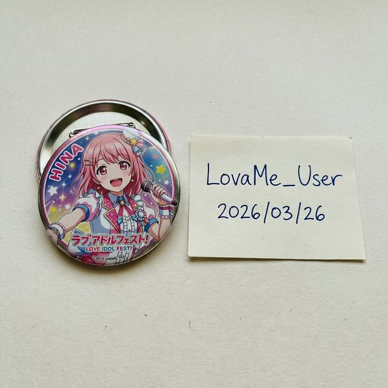

# 【第3回】なぜ必要？ID付き画像の正しい撮り方とNG例

「お取引の募集ツイートに、IDを書いた紙を添えてください」
初心者の方が最初にとまどうルールの一つが、この**「ID付き画像」**ではないでしょうか🔍

今回は、なぜこの画像が必要なのか、そして相手に安心感を与える「正しい撮り方」を掴めれば、お取引がぐっとやりやすくなります👌🏻

### 1. なぜ「ID付き画像」が必要なの？

最大の理由は、**「そのグッズを本当に自分が持っていることの証明」**、つまり**詐欺防止**のためです。

ネット上には、他人の画像を無断転載して、さも自分が持っているかのように見せかける悪質なケースも存在します。
手書きのID（Xのアカウント名など）と一緒に撮影することで、「いま私の手元にこのグッズがありますよ」という動かぬ証拠になります。

これが無いと、どんなに丁寧な言葉遣いでも「この画像、どこかから拾ってきたものかな？」と疑われてしまい、お声がけが来ない原因になります。

---

### 2. 正しい「ID付き画像」の撮り方

基本の構成は、**「交換したいグッズ」＋「手書きのメモ」**です。

#### 準備するもの
- **白い紙や付箋**: 小さなものでOKです。
- **ペン**: はっきりと読める濃い色（黒やネイビー）がベスト。

#### メモに書く内容
1. **X（Twitter）のID**: `@`から始まるユーザー名。
2. **日付**: 撮影した日の日付。

#### 撮影のコツ
- **明るい場所で撮る**: 自然光が入る昼間の室内が最も綺麗に撮れます。
- **ピントを合わせる**: グッズのデザインとメモの文字、両方が読めるようにしましょう。
- **背景をシンプルに**: 白い机や、無地の布の上などが好まれます。

---

### 3. これだけは避けて！NG例

知らずにやってしまいがちな「NG例」もチェックしておきましょう。

- **デジタル合成**: 写真にスマホの編集機能で文字を入れるのはNG。簡単に偽造できるため、信頼されません。必ず**リアルな紙**を使いましょう。
- **IDが隠れている**: グッズの上に紙が重なってデザインが見えない、あるいは紙の一部が切れていると、証明の意味をなしません。
- **使い回しの日付**: 数週間前の日付のままだと、「今はもう手元にないのでは？」と不安にさせます。再掲であっても、できれば最新の日付で撮り直すのが親切です。

---

### 🎀 まとめ

いかがでしたでしょうか！第3回は、お取引の信頼の証である「ID付き画像」についてまとめました。
少し面倒に感じるかもしれませんが、丁寧な写真一枚で、お取引の成功率はぐっと上がりますよ！

次回は、いよいよ核心に迫る**「住所交換のタイミングとDMのマナー」**について詳しく解説します。お楽しみに！
