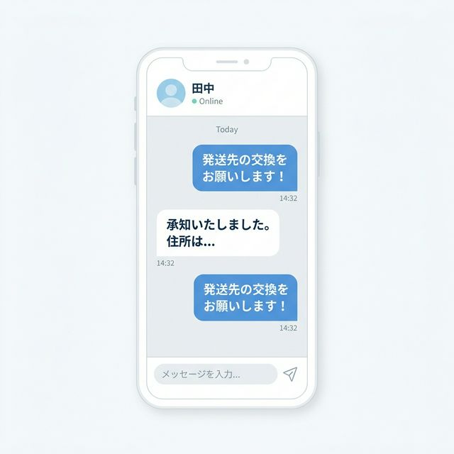

# 【第4回】住所交換のタイミングは？トラブルを防ぐためのDMの送り方とマナー

「リプライで合意した後はどうすればいいの？」「いきなり住所を教えていいのかな？」
お互いが合意した後のダイレクトメッセージ（DM）は、個人情報を扱う大切なステップです。

今回は、トラブルを防ぎ、スムーズにお取引を進めるための「DMのマナーとタイミング」について解説します👌🏻

---

### 1. DMに移行するタイミング

基本的には、**「リプライで双方の合意が取れた直後」**にDMへ移動します。

リプライ欄で「ぜひ交換お願いします！」などの最終確認が終わったら、どちらからともなく「詳細はDMにて失礼いたします」と一言添えて、メッセージを送りましょう🔍

---

### 2. まずは「挨拶」と「内容確認」から

いきなり住所を送るのはNGです！
まずは、どのグッズの交換なのかを改めて確認し、お互いに間違いがないかチェックしましょう。

#### 最初のメッセージの例
> 「こんにちは、リプライさせていただいた〇〇です。この度は交換のお手配ありがとうございます！
> 改めまして、こちらの【キャラ名】と、〇〇様の【キャラ名】の交換でお間違いございませんでしょうか？」

このように、具体的なグッズ名を出すことで、「違うものが届いた！」というトラブルを未然に防げます。

---

### 3. 住所交換は「内容合意」のあとで

グッズの確認ができたら、いよいよ住所交換です。
お互いの「梱包方法」や「発送予定日」についても、このタイミングで相談しておくと安心感が増しますよ。

#### 住所を送る際の一言
> 「ご確認ありがとうございます。それでは、発送先の交換をお願いできますでしょうか？
> こちらの住所は以下の通りです。
> 〒000-0000 〇〇県……」

相手が先に送ってくれた場合は、「住所のご提示ありがとうございます。こちらも失礼いたします」と続けて自分の情報を送りましょう👌🏻

---

### 4. プライバシーを守るための注意点

個人情報を扱うため、以下の点には特に注意しましょう。

- **スクショ厳禁**: 相手の住所が写った画面をSNSに載せないのは当然ですが、間違えて自分のスマホに保存したままにしないよう注意が必要です。
- **お取引完了後の削除**: 郵便物が無事に届き、お取引が完了した後は、DMの履歴を削除（またはお互いに削除し合う）のがお取引界隈の一般的なルールです。

---

### 🎀 まとめ

いかがでしたでしょうか！第4回は、お取引の核心である「DMマナーと住所交換」についてまとめました。
丁寧な言葉遣いと、一歩一歩の確認を大切にすれば、初めての住所交換も怖くありません👌🏻

次回は、お取引の大詰め！**「無事に届いたことを伝える受取連絡」**のルールについて詳しく解説します。お楽しみに！
